k_vals = dispersion[:, 0]
c_vals = dispersion[:, 1]

# Full Notebook Workflow as Mermaid Flowchart

The following Mermaid flowchart represents each major stage (cell) of the notebook as a box, from start to finish:

```mermaid
flowchart TD
    %% Main steps
    A(Set up sys.path and ROOT directory)
    B(Import modules)
    C(Set up Torch and Device)
    D(Build Models)
    E(Load Config & Geometry)
    F(Define trainable phase velocity c)
    G(Set up Optimizer)
    H(Training Loop Dispersion)
    I(Save Model)
    J(Choose time & y-location)
    K(Create z-grid for plotting)
    L(Feed to model for predictions)
    M(Plot Dispersion Curves)

    %% Sub-steps for each main step
    A1(Import sys, os)
    A2(Define ROOT path)
    A3(Append ROOT to sys.path)
    A --> A1 --> A2 --> A3

    B1(Import networks)
    B2(Import config)
    B3(Import sampling)
    B4(Import losses)
    B5(Import PDEs)
    B6(Import BCs)
    B --> B1 --> B2 --> B3 --> B4 --> B5 --> B6

    C1(Import torch)
    C2(Import torch.optim)
    C3(Select device)
    C --> C1 --> C2 --> C3

    D1(Call get_all_networks)
    D2(Move models to device)
    D --> D1 --> D2

    E1(Load geometry from config)
    E2(Load layer params)
    E3(Load halfspace params)
    E4(Init dispersion list)
    E --> E1 --> E2 --> E3 --> E4

    F1(Compute initial c)
    F2(Define c as trainable)
    F --> F1 --> F2

    G1(Combine model params)
    G2(Init Adam optimizer)
    G --> G1 --> G2

    H1(Loop over k values)
    H2(Inner training loop)
    H3(Sample domain points)
    H4(Compute loss)
    H5(Backward + step)
    H6(Append to dispersion)
    H --> H1 --> H2 --> H3 --> H4 --> H5 --> H6

    I1(Save model state_dict)
    I2(Save c value)
    I --> I1 --> I2

    J1(Set device)
    J2(Extract geometry H, L)
    J --> J1 --> J2

    K1(Create z_layer grid)
    K2(Create z_half grid)
    K --> K1 --> K2

    L1(Disable grad)
    L2(Scale output)
    L3(Predict with models)
    L --> L1 --> L2 --> L3

    M1(Prepare data for plot)
    M2(Plot with matplotlib)
    M --> M1 --> M2

    %% Connect main steps
    A3 --> B
    B6 --> C
    C3 --> D
    D2 --> E
    E4 --> F
    F2 --> G
    G2 --> H
    H6 --> I
    I2 --> J
    J2 --> K
    K2 --> L
    L3 --> M
```

Each box represents a key cell or stage in the notebook's workflow. Copy this into a Mermaid-compatible Markdown viewer to visualize the process.
